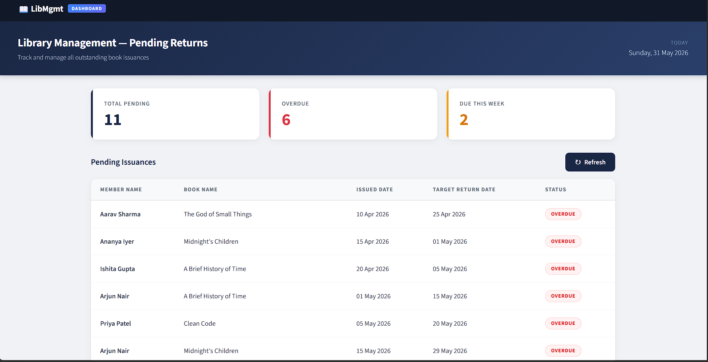
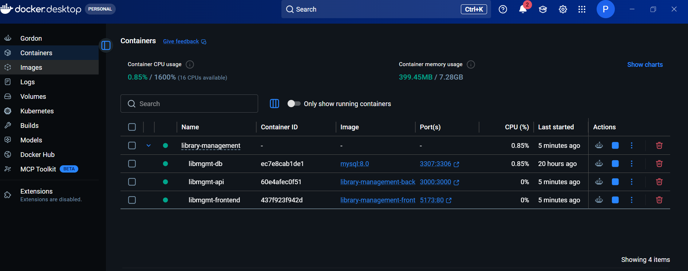

# Library Management System

<div align="center">

**A full-stack library management system built for Alt Life Labs internship assignment**

[](https://nodejs.org/)
[](https://reactjs.org/)
[](https://www.mysql.com/)
[](https://www.docker.com/)
[](https://expressjs.com/)
[](LICENSE)

</div>

---

## 📖 Table of Contents

- [Overview](#-overview)
- [Screenshots](#-screenshots)
- [High-Level Architecture](#-high-level-architecture)
- [Database Design](#-database-design)
- [Folder Structure](#-folder-structure)
- [Tech Stack](#-tech-stack)
- [API Documentation](#-api-documentation)
- [SQL Queries](#-sql-queries)
- [Setup & Installation](#-setup--installation)
- [Authentication](#-authentication)
- [AI Assistance Note](#-ai-assistance-note)

---

## 🌟 Overview

**LibMgmt** is a full-stack library management system that handles member management, book cataloguing, and book issuance tracking. It exposes a secure REST API, a MySQL database with proper relational design, and a React dashboard for librarians to monitor pending book returns at a glance.

### What it covers

- ✅ **Database** — MySQL 8 with 6 tables, foreign key constraints, and realistic seed data
- ✅ **REST APIs** — CRUD endpoints for Members, Books, and Issuances with API key authentication
- ✅ **SQL Queries** — Analytical queries for outstanding books, never-borrowed books, and top-10 most borrowed
- ✅ **Dashboard UI** — React dashboard showing all pending returns with OVERDUE / DUE SOON / ON TIME badges
- ✅ **Containerized** — Full Docker Compose setup, one command to run everything

---

## 📸 Screenshots

### Dashboard — Pending Returns

*Library dashboard showing 11 pending returns, 6 overdue, with color-coded status badges*

### Docker Desktop — All 3 Containers Running

*All three containers (MySQL, API, Frontend) running healthy via Docker Compose*

---

## 🏗️ High-Level Architecture

```
┌─────────────────────────────────────────────────────────┐
│                  LIBRARY MANAGEMENT SYSTEM              │
└─────────────────────────────────────────────────────────┘

┌──────────────────────┐         ┌──────────────────────┐
│   REACT DASHBOARD    │         │    REST API CLIENT   │
│  (Vite + plain CSS)  │         │  (Postman / cURL)    │
│                      │         │                      │
│  • Pending Returns   │         │  • All CRUD routes   │
│  • Summary Cards     │         │  • API Key header    │
│  • Status Badges     │         │                      │
└──────────┬───────────┘         └──────────┬───────────┘
           │                                │
           │    HTTP  (port 3000)           │
           └────────────────────────────────┘
                          │
                          ▼
┌─────────────────────────────────────────────────────────┐
│              EXPRESS.JS API SERVER (port 3000)          │
│                                                         │
│  Middleware Stack:                                      │
│  ┌──────────────────────────────────────────────────┐  │
│  │  CORS → JSON Parser → Auth Middleware (API Key)  │  │
│  └──────────────────────────────────────────────────┘  │
│                                                         │
│  Routes:                                                │
│  • GET /health            → Health check (no auth)     │
│  • /member                → Member CRUD                │
│  • /book                  → Book CRUD                  │
│  • /issuance              → Issuance CRUD              │
│  • /issuance/pending/today → Dashboard endpoint        │
└─────────────────────┬───────────────────────────────────┘
                      │
                      ▼
┌─────────────────────────────────────────────────────────┐
│              MySQL 8 DATABASE (port 3307)               │
│                                                         │
│  Tables: member, membership, collection,                │
│          category, book, issuance                       │
│                                                         │
│  Init: schema.sql → seed.sql (via Docker entrypoint)   │
└─────────────────────────────────────────────────────────┘
```

### Request Flow

```
HTTP Request
    → CORS middleware
    → Auth middleware (checks x-api-key header)
    → Route handler
    → mysql2 connection pool query
    → JSON response
```

### Docker Network

```
docker-compose.yml
    ├── db (mysql:8.0)         → internal: db:3306  │ external: localhost:3307
    ├── backend (node:18-alpine) → waits for db healthy, connects via DB_HOST=db
    └── frontend (nginx:alpine)  → serves React build on port 5173
```

---

## 🗄️ Database Design

### Entity Relationship Diagram

Based on the provided dbdiagram spec at https://dbdiagram.io/d/6148c958825b5b01460afb74

```
┌─────────────┐         ┌───────────────┐
│   member    │◄────────│  membership   │
│─────────────│  1 : N  │───────────────│
│ mem_id (PK) │         │membership_id  │
│ mem_name    │         │member_id (FK) │
│ mem_phone   │         │status         │
│ mem_email   │         └───────────────┘
└──────┬──────┘
       │ 1 : N
       │
       ▼
┌─────────────────┐       ┌────────────────┐
│   issuance      │       │      book      │
│─────────────────│       │────────────────│
│ issuance_id (PK)│       │ book_id (PK)   │
│ book_id (FK)    │──────►│ book_name      │
│ issuance_member │       │ book_cat_id    │──────► category
│ issuance_date   │       │ book_coll_id   │──────► collection
│ issued_by       │       │ book_launch_dt │
│ target_ret_date │       │ book_publisher │
│ issuance_status │       └────────────────┘
└─────────────────┘
```

### Tables

#### `member`
| Column | Type | Notes |
|--------|------|-------|
| mem_id | INT (PK, AI) | Primary key |
| mem_name | VARCHAR(100) | Not null |
| mem_phone | VARCHAR(20) | Optional |
| mem_email | VARCHAR(100) | Optional |

#### `membership`
| Column | Type | Notes |
|--------|------|-------|
| membership_id | INT (PK, AI) | |
| member_id | INT (FK) | References `member.mem_id` |
| status | VARCHAR(20) | Default: `active` |

#### `book`
| Column | Type | Notes |
|--------|------|-------|
| book_id | INT (PK, AI) | |
| book_name | VARCHAR(200) | Not null |
| book_cat_id | INT (FK) | References `category.cat_id` |
| book_collection_id | INT (FK) | References `collection.collection_id` |
| book_launch_date | DATETIME | |
| book_publisher | VARCHAR(100) | Used as author field |

#### `issuance`
| Column | Type | Notes |
|--------|------|-------|
| issuance_id | INT (PK, AI) | |
| book_id | INT (FK) | References `book.book_id` |
| issuance_date | DATETIME | |
| issuance_member | INT (FK) | References `member.mem_id` |
| issued_by | VARCHAR(100) | Librarian name |
| target_return_date | DATETIME | |
| issuance_status | VARCHAR(20) | `pending` or `returned` |

> **Design Note:** In the original dbdiagram text, `book_cat_id` and `book_collection_id` were listed as `varchar`. Since they are foreign keys referencing integer primary keys, these were correctly implemented as `INT` to allow proper MySQL foreign key constraints.

### Seed Data

| Entity | Count | Details |
|--------|-------|---------|
| Members | 12 | Indian names, phone numbers, emails |
| Memberships | 12 | Mix of active/inactive |
| Collections | 4 | Fiction, Science, History, Technology |
| Categories | 5 | With subcategories (e.g. Literature > Indian Fiction) |
| Books | 25 | Real titles, real authors, dates 2010–2023 |
| Issuances | 20 | 11 pending (6 overdue), 9 returned |

---

## 📂 Folder Structure

```
library-management/
│
├── docker-compose.yml             # Orchestrates all 3 containers
├── .env                           # Environment variables (gitignored)
├── .env.example                   # Template for required env vars
├── .gitignore
├── README.md
├── Validation_Document.md         # Assignment validation with test outputs
│
├── db/
│   ├── schema.sql                 # CREATE TABLE statements (6 tables)
│   └── seed.sql                   # INSERT sample data (12 members, 25 books, 20 issuances)
│
├── backend/
│   ├── Dockerfile                 # node:18-alpine image
│   ├── package.json
│   ├── server.js                  # Express entry point, route mounting, error handler
│   ├── db.js                      # mysql2 pool with 10-retry startup loop
│   │
│   ├── middleware/
│   │   └── auth.js                # x-api-key header validation
│   │
│   └── routes/
│       ├── member.js              # GET all, GET by ID (+ history), POST, PUT
│       ├── book.js                # GET all (with joins), GET by ID (+count), POST, PUT
│       └── issuance.js            # /pending/today (before /:id), full CRUD
│
├── frontend/
│   ├── Dockerfile                 # Multi-stage: node build → nginx serve
│   ├── nginx.conf                 # SPA routing (try_files fallback)
│   ├── package.json
│   ├── vite.config.js
│   ├── index.html
│   │
│   └── src/
│       ├── main.jsx               # React entry point
│       ├── App.jsx                # Nav bar + Dashboard wrapper
│       ├── api.js                 # fetch wrapper with API key header
│       └── components/
│           └── Dashboard.jsx      # Pending returns table, summary cards, badges
│
└── sql/
    └── queries.sql                # 3 analytical SQL queries with comments
```

---

## 🔧 Tech Stack

### Backend

| Technology | Version | Purpose |
|------------|---------|---------|
| **Node.js** | 18+ | JavaScript runtime |
| **Express** | 4.18 | Web framework & routing |
| **mysql2** | 3.6 | MySQL driver with Promise support |
| **dotenv** | 16.3 | Environment variable loading |
| **cors** | 2.8 | Cross-origin request handling |

### Frontend

| Technology | Version | Purpose |
|------------|---------|---------|
| **React** | 18.2 | UI component library |
| **Vite** | 5.0 | Build tool & dev server |
| **Plain CSS** | — | Styling (no external UI library) |
| **Source Sans 3** | — | Google Font for clean typography |

### Infrastructure

| Technology | Version | Purpose |
|------------|---------|---------|
| **MySQL** | 8.0 | Relational database |
| **Docker** | — | Container runtime |
| **Docker Compose** | — | Multi-container orchestration |
| **nginx** | alpine | Serve React build in production |

---

## 📡 API Documentation

### Base URL
```
http://localhost:3000
```

### Authentication
All endpoints (except `GET /health`) require the `x-api-key` header:
```
x-api-key: libmgmt-secret-key-2024
```

---

### Health

| Method | Endpoint | Auth | Description |
|--------|----------|------|-------------|
| GET | `/health` | ❌ None | Server health check |

**Response:**
```json
{ "status": "ok", "timestamp": "2026-05-31T06:38:52.428Z" }
```

---

### Members

| Method | Endpoint | Auth | Description |
|--------|----------|------|-------------|
| GET | `/member` | ✅ | All members with membership status |
| GET | `/member/:id` | ✅ | Single member + full issuance history |
| POST | `/member` | ✅ | Create member (auto-creates active membership) |
| PUT | `/member/:id` | ✅ | Update member details |

**POST /member — Request Body:**
```json
{
  "mem_name": "Neha Kapoor",
  "mem_phone": "9812345000",
  "mem_email": "neha.kapoor@gmail.com"
}
```

**GET /member/1 — Response:**
```json
{
  "mem_id": 1,
  "mem_name": "Aarav Sharma",
  "mem_phone": "9876543210",
  "mem_email": "aarav.sharma@gmail.com",
  "membership_status": "active",
  "issuances": [
    {
      "issuance_id": 1,
      "book_name": "The God of Small Things",
      "issuance_date": "2026-04-10T10:00:00.000Z",
      "target_return_date": "2026-04-25T10:00:00.000Z",
      "issuance_status": "pending"
    }
  ]
}
```

---

### Books

| Method | Endpoint | Auth | Description |
|--------|----------|------|-------------|
| GET | `/book` | ✅ | All books with category & collection names |
| GET | `/book/:id` | ✅ | Single book with issuance_count |
| POST | `/book` | ✅ | Add a new book |
| PUT | `/book/:id` | ✅ | Update book details |

**GET /book/1 — Response:**
```json
{
  "book_id": 1,
  "book_name": "The God of Small Things",
  "book_launch_date": "2010-06-15T00:00:00.000Z",
  "book_publisher": "Arundhati Roy",
  "cat_name": "Literature",
  "sub_cat_name": "Indian Fiction",
  "collection_name": "Fiction",
  "issuance_count": 3
}
```

---

### Issuances

| Method | Endpoint | Auth | Description |
|--------|----------|------|-------------|
| GET | `/issuance` | ✅ | All issuances with member & book names |
| GET | `/issuance/pending/today` | ✅ | All pending returns (dashboard feed) |
| GET | `/issuance/:id` | ✅ | Single issuance with full details |
| POST | `/issuance` | ✅ | Create a new issuance |
| PUT | `/issuance/:id` | ✅ | Update status (e.g., mark returned) |

**GET /issuance/pending/today — Response:**
```json
[
  {
    "issuance_id": 1,
    "mem_name": "Aarav Sharma",
    "book_name": "The God of Small Things",
    "issuance_date": "2026-04-10T10:00:00.000Z",
    "target_return_date": "2026-04-25T10:00:00.000Z",
    "issuance_status": "pending",
    "issued_by": "Librarian Deepa"
  }
]
```

> **Implementation Note:** The `/pending/today` route is registered **before** `/:id` in `issuance.js`. This is critical — if reversed, Express would match the string `"pending"` as an `:id` parameter and the route would fail.

---

## 🔍 SQL Queries

All three required queries are in [`sql/queries.sql`](sql/queries.sql).

### Query 1 — Books Never Borrowed

```sql
SELECT 
    b.book_name AS "Book Name",
    b.book_publisher AS "Author"
FROM book b
LEFT JOIN issuance i ON b.book_id = i.book_id
WHERE i.book_id IS NULL
ORDER BY b.book_name;
```

**Output (10 books never borrowed):**
```
+---------------------------------------------------+--------------------+
| Book Name                                         | Author             |
+---------------------------------------------------+--------------------+
| Design Patterns                                   | Erich Gamma et al. |
| Guns, Germs, and Steel                            | Jared Diamond      |
| India After Gandhi                                | Ramachandra Guha   |
| Introduction to Algorithms                        | Thomas H. Cormen   |
| Structure and Interpretation of Computer Programs | Harold Abelson     |
+---------------------------------------------------+--------------------+
```

---

### Query 2 — Outstanding Books (currently not returned)

```sql
SELECT
    m.mem_name AS "Member Name",
    b.book_name AS "Book Name",
    DATE_FORMAT(i.issuance_date, '%d %b %Y') AS "Issued Date",
    DATE_FORMAT(i.target_return_date, '%d %b %Y') AS "Target Return Date",
    b.book_publisher AS "Author"
FROM issuance i
JOIN member m ON i.issuance_member = m.mem_id
JOIN book b ON i.book_id = b.book_id
WHERE i.issuance_status = 'pending'
ORDER BY i.target_return_date ASC;
```

---

### Query 3 — Top 10 Most Borrowed Books

```sql
SELECT
    b.book_name AS "Book Name",
    COUNT(i.issuance_id) AS "# of times borrowed",
    COUNT(DISTINCT i.issuance_member) AS "# of Members that borrowed"
FROM issuance i
JOIN book b ON i.book_id = b.book_id
GROUP BY b.book_id, b.book_name
ORDER BY COUNT(i.issuance_id) DESC
LIMIT 10;
```

**Output:**
```
+-------------------------------+---------------------+----------------------------+
| Book Name                     | # of times borrowed | # of Members that borrowed |
+-------------------------------+---------------------+----------------------------+
| The God of Small Things       |                   3 |                          3 |
| Midnight's Children           |                   2 |                          2 |
| A Brief History of Time       |                   2 |                          2 |
| Clean Code                    |                   2 |                          2 |
+-------------------------------+---------------------+----------------------------+
```

---

## 🚀 Setup & Installation

### Prerequisites

- [Docker Desktop](https://docs.docker.com/desktop/install/windows-install/) installed and running

### Quick Start

```bash
# 1. Clone the repository
git clone https://github.com/pranav-kalvium/Library-management-ALT-LIFE-LABS.git
cd Library-management-ALT-LIFE-LABS

# 2. Copy environment file
cp .env.example .env
# Edit .env with your preferred values if needed (defaults work out of the box)

# 3. Start all 3 containers
docker compose up --build
```

That's it. Docker will:
1. Pull MySQL 8, Node 18, and nginx images
2. Run `schema.sql` then `seed.sql` to initialize the database
3. Start the backend (waits for MySQL healthcheck to pass)
4. Build and serve the React frontend via nginx

### Access Points

| Service | URL | Notes |
|---------|-----|-------|
| **Dashboard** | http://localhost:5173 | React frontend |
| **API** | http://localhost:3000 | Express backend |
| **Health Check** | http://localhost:3000/health | No auth required |
| **MySQL** | localhost:3307 | Host port (3306 is used internally) |

### Environment Variables

Copy `.env.example` to `.env` and configure:

```env
# Database
DB_HOST=db
DB_PORT=3306
DB_USER=libuser
DB_PASSWORD=libpass123
DB_NAME=libmgmt
MYSQL_ROOT_PASSWORD=rootpass123

# API
API_KEY=libmgmt-secret-key-2024
PORT=3000

# Frontend (built at Docker build time)
VITE_API_URL=http://localhost:3000
VITE_API_KEY=libmgmt-secret-key-2024
```

> **Note:** `DB_HOST=db` refers to the Docker service name. When running the backend locally (outside Docker), change this to `localhost` and set `DB_PORT=3307`.

### Run SQL Queries Manually

```bash
# Using Docker
docker exec -i libmgmt-db mysql -ulibuser -plibpass123 libmgmt -e "source /sql/queries.sql"

# Or pipe from file (PowerShell)
Get-Content sql/queries.sql | docker exec -i libmgmt-db mysql -ulibuser -plibpass123 libmgmt -t
```

---

## 🔒 Authentication

All API calls (except `GET /health`) require the `x-api-key` header.

**Example — curl:**
```bash
curl -H "x-api-key: libmgmt-secret-key-2024" http://localhost:3000/book
```

**Example — PowerShell:**
```powershell
$headers = @{ "x-api-key" = "libmgmt-secret-key-2024" }
Invoke-WebRequest -Uri "http://localhost:3000/book" -Headers $headers | Select-Object -ExpandProperty Content
```

**Without the header:**
```json
{ "error": "Unauthorized: invalid or missing API key" }
```

**Implementation** — `backend/middleware/auth.js`:
- Reads valid key from `process.env.API_KEY`
- Checks the `x-api-key` request header
- Returns 401 if missing or mismatched
- Skips check for `GET /health` (health probes don't have the key)

---


<div align="center">

**Built for the Alt Life Labs Internship Assignment - May 2026**

</div>
